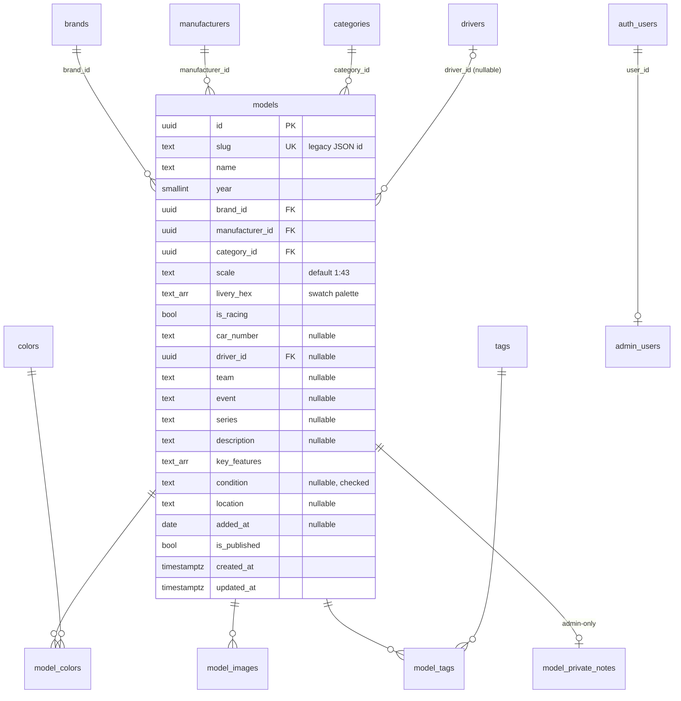

# Supabase Schema Design (Phase 4)

**Status: proposed, awaiting owner approval.** Documentation only; no database exists yet. Phase 6 turns this into `supabase/migrations/*` and Phase 7 implements the import mapping in §6.

Inputs: [`docs/AUDIT.md`](AUDIT.md) (findings D1–D14), the three mockups in `diecast-details/`, the real `src/data/car-models.json` (227 models), and owner decisions from 2026-09-27 (§2).

---

## 1. Design principles

1. **Slug is the identity users see.** `models.slug` = the legacy JSON `id`, **verbatim, never regenerated** (D11). Old `?model=<id>` links and future `/models/<slug>` URLs both resolve through it. The `uuid` primary key stays internal.
2. **Normalize only what is filtered, counted or browsed.** Brands, manufacturers, categories, colors, drivers and tags get tables, because they need facet counts, browse pages or logos. Free-text attributes (team, event, series, location) stay as columns. Promote a column to a table only when a real need appears.
3. **RLS is row-level, not column-level.** Anything private lives in its own table (`model_private_notes`) and never shares a row with public data.
4. **Nothing is fabricated.** New fields (description, features, tags, condition, location…) are nullable or empty for the 227 imported rows, and the UI renders them conditionally.
5. **Everything lives in the `diecast` Postgres schema, not `public`** (decided in Phase 5; see `docs/SUPABASE-SETUP.md`). The project is dedicated to this app, but a named schema makes a future move (`pg_dump --schema=diecast`) or sharing trivial. It must be listed under **Data API → Exposed schemas**, and needs explicit `grant usage` to `anon` / `authenticated` (RLS still decides row access).
6. **Read path = one summary list.** Per the architecture in ROADMAP, the app loads all published models once and filters, searches and sorts client-side. The schema is optimized for that single query (the `model_summaries` view), not for server-side search.

## 2. Owner decisions (2026-09-27)

| Question | Decision | Schema effect |
| --- | --- | --- |
| Public "My Collection" fields | **Condition, Added date, Location** are public | Columns on `models` (public row). Only `model_private_notes` is admin-only |
| Collection status / "Collected" | **Not needed.** Every model in the collection is owned | **No status column.** The form's "Collected" checkbox and the details-page "Collected" badge are dropped (UI deviation, Phases 19/25). "Save as Draft" is covered by `is_published` |
| Corvette vs Chevrolet | **Merge into Chevrolet** | Importer maps brand `Corvette` → `Chevrolet` (1 model). Slug `corvette-c5r-…` is kept verbatim. 45 brands instead of 46 |
| Scale | **All 227 are 1:43** | `scale text not null default '1:43'`; no `scales` table |
| Trucks | Not migrated (ROADMAP architecture) | No truck categories, brands or manufacturers are created |

Still open, not blocking: heart / "Add to Collection" meaning (Phase 19), the breadcrumb "model line" level (§8), rich-text vs plain description (Phase 26), and whether **"DTM" is really a manufacturer** (see D15).

## 3. Entity-relationship diagram



## 4. Tables

Conventions:
- Every table has `id uuid primary key default gen_random_uuid()` unless noted, plus `created_at timestamptz not null default now()`.
- Mutable tables also get `updated_at timestamptz not null default now()`, maintained by a shared `set_updated_at()` trigger.
- Slugs everywhere match `^[a-z0-9]+(-[a-z0-9]+)*$`. All 227 legacy ids already pass this.
- FKs from `models` to lookups are `ON DELETE RESTRICT`, so a lookup can't be deleted while it's in use. Child tables of `models` are `ON DELETE CASCADE`.

### 4.1 `models`

| Column | Type | Null | Default / constraint | Notes |
| --- | --- | --- | --- | --- |
| `id` | `uuid` | no | PK | |
| `slug` | `text` | no | **unique**, slug check, length ≤ 80 | Legacy `id` verbatim (max today: 57). Stable after creation (Phase 25) |
| `name` | `text` | no | `char_length(btrim(name)) between 1 and 120` | Includes the brand today ("Aston Martin AMR-One"). Kept as-is |
| `year` | `smallint` | no | `between 1885 and extract(year from now())::int + 1` → implemented as a trigger or a fixed upper bound of 2100 (CHECK must be immutable) | Real-car year, 1969–2023 today |
| `brand_id` | `uuid` | no | FK `brands` RESTRICT | |
| `manufacturer_id` | `uuid` | no | FK `manufacturers` RESTRICT | |
| `category_id` | `uuid` | no | FK `categories` RESTRICT | |
| `scale` | `text` | no | `'1:43'`, check `^1:[0-9]{1,3}$` | D1 / owner: all 1:43 |
| `livery_hex` | `text[]` | no | `'{}'`, check via `is_hex_palette(livery_hex)`: every element `^#[0-9A-F]{6}$`, 0–8 elements | Card/detail swatch. **Not** the filter colors (D3). Order matters (conic slices) |
| `is_racing` | `boolean` | no | `false` | Drives whether racing UI shows. Imported as `category ∈ {Rally, Racing}` (D7) |
| `car_number` | `text` | yes | check `^[0-9A-Z]{1,4}$` | **Text, not int** (roadmap said int): real numbers like `00`, `07`, `3A` must round-trip. Imported from numbers (1–206) |
| `driver_id` | `uuid` | yes | FK `drivers` RESTRICT | One driver per model today; a co-driver table can come later if needed |
| `team` | `text` | yes | length ≤ 120 | Mockup Racing section |
| `event` | `text` | yes | length ≤ 120 | Race / event, e.g. "24h Le Mans" |
| `series` | `text` | yes | length ≤ 120 | "Series / Collection" (e.g. a partwork line). Form suggests existing distinct values |
| `description` | `text` | yes | length ≤ 10 000 | **Stored as plain text / markdown-lite, never HTML** (Phase 26 decides the rendering) |
| `key_features` | `text[]` | no | `'{}'`, ≤ 12 items | Ordered bullet list ("Key Features") |
| `condition` | `text` | yes | check `in ('mint','near_mint','excellent','good','fair','poor')` | Public (owner). Stable, short list: check constraint instead of a table |
| `location` | `text` | yes | length ≤ 80 | Public (owner). Free text with suggestions ("Display Cabinet") |
| `added_at` | `date` | yes | | Public. D13: backfilled for ~23 models from git, NULL for the rest |
| `is_published` | `boolean` | no | `true` | `false` = draft ("Save as Draft"); invisible to the public via RLS |
| `created_at` / `updated_at` | `timestamptz` | no | `now()` + trigger | |

Deliberately **not** on `models`:
- collection status (owner: everything is owned);
- a manual sort position (D14; sort is always by field, with `slug` as the tie-breaker);
- a name-tuple uniqueness (D10: `Porsche 911 GT3 R 2019 Ixo MULTI` legitimately exists twice).

### 4.2 `brands`, `manufacturers`

| Column | Type | Null | Constraint | Notes |
| --- | --- | --- | --- | --- |
| `id` | `uuid` | no | PK | |
| `slug` | `text` | no | unique, slug check | `Citroën` → `citroen`, `Leo Models` → `leo-models`, `iScale` → `iscale` |
| `name` | `text` | no | unique (case-insensitive: unique index on `lower(name)`) | Display name incl. diacritics |
| `logo_path` | `text` | yes | | See §7. e.g. `/brands/Citroën.svg` |
| `created_at` / `updated_at` | `timestamptz` | no | | |

After import: **45 brands** (46 minus Corvette), **19 manufacturers**.

### 4.3 `categories`

`id`, `slug` (unique), `name` (unique), `sort_order smallint not null default 0`, timestamps.

A table, not an enum, because the mockup implies categories evolve and Phase 28 manages them from the UI. **Colors are not stored here.** They come from CSS tokens keyed by slug (`--cat-<slug>`, Phase 3), and unknown slugs fall back to `--cat-fallback`.

Seed (Phase 6 migration, in display order): `rally` Rally · `racing` Racing · `supercar` Supercar · `premium` Premium · `retro` Retro.

### 4.4 `colors` and `model_colors`

`colors`: `id`, `slug` (unique), `name` (unique), `hex text null` (check `^#[0-9A-F]{6}$`; representative swatch for the filter panel, **NULL for Multi** = conic rendering), `sort_order`, timestamps.

`model_colors`: `model_id` FK CASCADE, `color_id` FK RESTRICT, `position smallint not null`.
- PK `(model_id, color_id)`, unique `(model_id, position)`.
- 1–3 colors per model is enforced by the form and checked by `verify-migration` (Phase 8). A CHECK can't count rows, and a trigger isn't worth it.

Seed from data (13): Black, Blue, Gold, Gray, Green, **Multi** (legacy `MULTI`, D4), Orange, Pink, Purple, Red, Silver, White, Yellow.

### 4.5 `drivers`

`id`, `slug` (unique), `name` (unique), `country_code char(2) null` (check `^[A-Z]{2}$`, ISO 3166-1 alpha-2; D2: all NULL at import), timestamps.

After the alias map (D5): **138 drivers** (143 distinct strings − 5 merges). Fictional livery names (Edwin, Jesse, Suki, Davy Jones, Brian O'Conner) stay as drivers (D6).

### 4.6 `model_images`

| Column | Type | Null | Constraint | Notes |
| --- | --- | --- | --- | --- |
| `id` | `uuid` | no | PK | |
| `model_id` | `uuid` | no | FK `models` CASCADE | |
| `position` | `smallint` | no | ≥ 0, unique `(model_id, position)` | Gallery order |
| `is_primary` | `boolean` | no | `false`; **partial unique index** `(model_id) where is_primary` | Exactly one primary is a Phase 27 UI rule; at most one is DB-enforced |
| `storage_path` | `text` | yes | | Supabase Storage key for the full image (Phase 21+) |
| `thumb_storage_path` | `text` | yes | | |
| `external_url` | `text` | yes | check `^https://` | Today's postimg URL. **This is the roadmap's `legacy_url`.** It is kept after Phase 21 as the rollback path |
| `thumb_external_url` | `text` | yes | check `^https://` | |
| `alt` | `text` | yes | ≤ 200 | Defaults to the model name in the UI when NULL |
| `width` / `height` | `integer` | yes | > 0 | Filled when known (Phase 21/27) to prevent layout shift |
| `created_at` / `updated_at` | `timestamptz` | no | | |

Row check: `storage_path is not null or external_url is not null`.

**URL resolution (one function in the service layer):** `storage_path` → public Storage URL, else `external_url`. Same for thumbnails, then fall back to the full image. No base64 or binary data in Postgres.

Import: one row per model (position 0, `is_primary = true`, both postimg URLs) → **227 rows**.

### 4.7 `tags` and `model_tags`

`tags`: `id`, `slug` (unique), `name` (unique), timestamps. `model_tags`: `model_id` CASCADE, `tag_id` RESTRICT, PK `(model_id, tag_id)`. **0 rows at import.**

### 4.8 `model_private_notes` (admin-only)

`model_id uuid primary key` FK `models` CASCADE, `notes text not null` (≤ 10 000), `updated_at`. One row per model, created on first save. Kept in its own table so RLS can hide it completely: anon and non-admin users get zero rows, not NULL columns.

### 4.9 `admin_users`

`user_id uuid primary key references auth.users on delete cascade`, `created_at`. It holds the owner allow-list and is readable only by admins. The owner row is inserted manually (Phase 6).

### 4.10 Functions, triggers, views

| Object | Definition | Purpose |
| --- | --- | --- |
| `is_admin()` | `returns boolean language sql stable security definer set search_path = ''` → `exists (select 1 from diecast.admin_users where user_id = auth.uid())` | Single gate used by every admin policy |
| `set_updated_at()` | trigger `before update` on every table with `updated_at` | |
| `is_hex_palette(text[])` | immutable SQL function used by the `livery_hex` CHECK | Array-element CHECKs can't use subqueries directly |
| `model_summaries` (view, **`security_invoker = true`** so RLS applies) | One row per model, with: slug, name, year, scale, is_racing, car_number, `livery_hex`, added_at, is_published; brand/manufacturer/category **slug + name** (+ logo paths); driver name; `color_slugs text[]` in position order; primary image thumb + full (resolved columns); condition/location | The single query behind `getModels()` (Phase 9). Keeps the client free of N+1 joins |

`getCollectionStats()` (Phase 23) is computed client-side from the cached list first. A SQL view is added only if Phase 33 measurements call for it.

## 5. Indexes

| Index | Why |
| --- | --- |
| Unique: `models(slug)`, `brands(slug)`, `manufacturers(slug)`, `categories(slug)`, `colors(slug)`, `drivers(slug)`, `tags(slug)` (+ `lower(name)` uniques on lookups) | Lookups by URL slug; prevent duplicate lookup names |
| `models(brand_id)`, `models(manufacturer_id)`, `models(category_id)`, `models(driver_id)` | FK columns (Postgres doesn't index them automatically). Used for browse pages, counts and RESTRICT checks |
| `model_colors(color_id)` | Reverse lookup (PK already covers `model_id`) |
| `model_tags(tag_id)` | Reverse lookup |
| `model_images(model_id, position)` unique; partial unique `(model_id) where is_primary` | Gallery order; one primary |
| `models(added_at desc nulls last, slug)` | "Recently added" for a future server-side sort. Cheap at this size |

**Search: no `pg_trgm` / `tsvector` now.** The architecture loads the whole summary list (~227 rows; the whole raw JSON is 90 KB today) and searches client-side with diacritic-insensitive matching (Phase 15). A search index would only matter for server-side search, which is reconsidered in Phase 33 if the collection passes about 1,500 models. Adding a generated `tsvector` column later is a non-breaking migration.

## 6. JSON → DB mapping

### 6.1 Every JSON key

| JSON key | Present | → Target | Transformation |
| --- | --- | --- | --- |
| `id` | 227 | `models.slug` | Verbatim (D11). Never regenerated |
| `name` | 227 | `models.name` | Trimmed |
| `year` | 227 | `models.year` | |
| `brand` | 227 | `models.brand_id` → `brands` | Upsert by name. **`Corvette` → `Chevrolet`** (owner). slug = `slugify(name)` |
| `manufacturer` | 227 | `models.manufacturer_id` → `manufacturers` | Upsert by name, as above |
| `category` | 227 | `models.category_id` → `categories` | Match seeded category by name. Unknown value = import **error** |
| `color` (1–3 names) | 227 | `model_colors` (+ `colors`) | Keep order as `position`. `MULTI` → color `Multi` (D4) |
| `hex` (1–4) | 227 | `models.livery_hex` | Verbatim, order kept (D3). Already uppercase `#RRGGBB` |
| `carNumber` | 169 | `models.car_number` | `String(n)` |
| `carDriver` | 170 | `models.driver_id` → `drivers` | NFC-normalize, U+2011 → `-`, then **alias map** (D5), then upsert by name |
| `driverCountry` | 0 | `drivers.country_code` | Never present (D2). NULL |
| `scale` | 0 | `models.scale` | Never present (D1). Explicit `'1:43'` |
| `thumbnail` | 227 | `model_images.thumb_external_url` | Verbatim (D12: opaque URLs) |
| `imageUrl` | 227 | `model_images.external_url` | Verbatim; `position 0`, `is_primary true` |
| `COMING_SOON` | 1 | *(dropped)* | D8: stray, unused key. The idea becomes a local missing-image fallback (Phase 29) |

### 6.2 Derived or new fields at import

| Column | Import value |
| --- | --- |
| `is_racing` | `category ∈ {Rally, Racing}` → **182 true**, 45 false. Every model with a driver or number is in those two categories. The 11 Rally/Racing models with neither are still race cars (D7; the audit said 12, re-measured as 11) |
| `added_at` | From `scripts/import/added-dates.json` (~23 models dated from git history); others NULL (D13) |
| `is_published` | `true` for all 227 |
| `team`, `event`, `series`, `description`, `condition`, `location` | NULL |
| `key_features` | `'{}'` |
| tags, private notes | none |

### 6.3 Driver alias map (D5), for review

Versioned as `scripts/import/driver-aliases.json` in Phase 7. Left side = raw JSON string, right side = canonical name.

| Raw | → Canonical | Reason |
| --- | --- | --- |
| `Sebastien Loeb` | `Sébastien Loeb` | Missing accent |
| `Francois Delecour` | `François Delecour` | Missing accent |
| `Sébatien Ogier` | `Sébastien Ogier` | Typo |
| `Marcel Faessler` | `Marcel Fässler` | Transliteration |
| `Augusto Farfus Júnior` | `Augusto Farfus` | Same person, common name |
| `Jean‑Karl Verney` (U+2011) | `Jean-Karl Verney` | Non-breaking hyphen normalized. Not a merge |
| `Jean‑Pierre Fontenay` (U+2011) | `Jean-Pierre Fontenay` | Same |

### 6.4 Expected import counts (verified against the data 2026-09-27)

`models 227 · brands 45 · manufacturers 19 · categories 5 · colors 13 · drivers 138 · model_colors 244 · model_images 227 · tags 0`

Phase 7's importer must print exactly these numbers, and Phase 8 verifies them. `model_colors` = 211×1 + 15×2 + 1×3 = 244.

## 7. Logo strategy

**Keep SVGs in `public/`; store the path.** `logo_path = '/brands/<Name>.svg'` / `'/manufacturers/<Name>.svg'` exactly as the files are named today, including `Citroën.svg`, `Škoda.svg` and `Leo Models.svg`. The UI applies `encodeURI()` when rendering.
- No file renames, and no risk of breaking the current app during migration.
- All 45 brands and 19 manufacturers have a logo file (checked).
- `Corvette.svg` becomes unused after the merge; it's removed in Phase 36 with the truck-only logos.
- Uploading new logos to Storage (Phase 28) just writes a different `logo_path`. The resolver accepts both a `/…` public path and a Storage key.

## 8. Mockup fields → schema

| Mockup field | Where | Schema |
| --- | --- | --- |
| Model Name, Year, Brand, Manufacturer | Form §1, details | `models.name/year/brand_id/manufacturer_id` |
| Category, Scale, Color | Form §2, spec tiles | `category_id`, `scale`, `model_colors` (+ `livery_hex` swatch) |
| Series / Collection | Form §2 | `models.series` |
| "This is a racing model", Racing Number, Driver, Team, Race/Event | Form §3 | `is_racing`, `car_number`, `driver_id`, `team`, `event` |
| Condition, Added Date, Location | Form §4, "My Collection" | `condition`, `added_at`, `location` (public) |
| Collected checkbox / "Collected" badge | Form §4, details | **Dropped.** Owner: everything is owned |
| Description (rich text toolbar) | Form §5, "About this model" | `description` (plain/markdown-lite; format decided in Phase 26) |
| Notes (private) | Form §5 | `model_private_notes.notes` |
| Public "Notes" row in details "My Collection" card / "Notes" tab | Details | **Deferred.** The form only has *private* notes, so there's no public source. Render nothing (Phase 19). A public `notes` column can be added later if wanted |
| Main image + additional images (5/10), primary star | Form §6, gallery "1 / 8" | `model_images` (`position`, `is_primary`; max 10 enforced by the UI) |
| Tags | Form §7, details | `tags` + `model_tags` |
| Key Features | Details | `models.key_features` |
| Save as Draft | Form header | `is_published = false` |
| Heart / "Add to Collection" | Details, Quick View | **Deferred to Phase 19.** Likely removed, since there's no status |
| Breadcrumb "model line" (`Chevrolet › Corvette › …`) | Details | **Deferred.** No data exists; breadcrumb is `Collection › Brand › Model`. Adding a nullable `model_line text` later is cheap |
| Live Preview, Checklist | Form | Derived in UI, no storage |
| Header "227 models" | Header | `count(*)` of published models (from the cached list) |

## 9. Data-quality decisions (D1–D15)

| # | Decision |
| --- | --- |
| D1 | `scale` default `'1:43'`, imported explicitly. Owner confirmed all 227 |
| D2 | `drivers.country_code` nullable, all NULL. Flags return only once countries are filled in (Phase 28) |
| D3 | Two concepts: `model_colors` (filter, 1–3) and `models.livery_hex` (swatch, 0–8). Not forced 1:1 |
| D4 | `MULTI` → color row `Multi` (slug `multi`, `hex` NULL = conic swatch) |
| D5 | Reviewed alias map (§6.3). 143 → 138 drivers |
| D6 | Fictional/nickname drivers kept as drivers |
| D7 | `is_racing` derived from category (182). Racing columns are independent and nullable, and the UI tolerates any combination |
| D8 | `COMING_SOON` not imported |
| D9 | **Corvette merged into Chevrolet** (owner). `range-rover-sport-…` slug kept with brand Land Rover |
| D10 | Uniqueness = `slug` only. No name-tuple constraint |
| D11 | Slugs imported verbatim. The slug CHECK already passes for all 227. Order is irrelevant in the DB |
| D12 | Image URLs treated as opaque; no filename parsing |
| D13 | `added_at` nullable; ~23 backfilled from git. "Recently added" sorts NULLs last, then by name (Phase 15) |
| D14 | No position column; ordering is always an explicit sort with `slug` as the tie-breaker |
| **D15** (new) | Manufacturer **"DTM"** (3 models) is a racing series, not a model maker. Imported **as-is**; the owner can rename it later (Phase 28) or give the correct manufacturers before Phase 7 |

## 10. RLS outline (implemented in Phase 6)

| Table | anon / authenticated non-admin | admin (`is_admin()`) |
| --- | --- | --- |
| `models` | `SELECT` where `is_published` | all |
| `model_colors`, `model_images`, `model_tags` | `SELECT` where the parent model is published (`exists (…)`) | all |
| `brands`, `manufacturers`, `categories`, `colors`, `drivers`, `tags` | `SELECT` all rows | all |
| `model_private_notes` | **nothing** | all |
| `admin_users` | **nothing** | `SELECT` |
| view `model_summaries` | inherits the table policies (`security_invoker`) | |

Public sign-ups are disabled in Supabase Auth. `SUPABASE_SERVICE_ROLE_KEY` is used only by local scripts (Phases 7, 8, 21).

## 11. Proposed DDL sketch (reference for Phase 6, not a migration)

```sql
create schema if not exists diecast;
-- Schema-level access only; row access is decided by RLS policies (Phase 6).
grant usage on schema diecast to anon, authenticated, service_role;
alter default privileges in schema diecast grant select on tables to anon, authenticated;
alter default privileges in schema diecast grant all on tables to service_role;
-- authenticated also gets insert/update/delete on tables, gated by is_admin() policies.

create function diecast.set_updated_at() returns trigger language plpgsql as $$
begin new.updated_at = now(); return new; end $$;

create function diecast.is_hex_palette(p text[]) returns boolean
language sql immutable as $$
  select coalesce(array_length(p, 1), 0) <= 8
     and not exists (select 1 from unnest(p) h where h !~ '^#[0-9A-F]{6}$')
$$;

create table diecast.brands (
  id uuid primary key default gen_random_uuid(),
  slug text not null unique check (slug ~ '^[a-z0-9]+(-[a-z0-9]+)*$'),
  name text not null check (char_length(btrim(name)) between 1 and 80),
  logo_path text,
  created_at timestamptz not null default now(),
  updated_at timestamptz not null default now()
);
create unique index brands_name_lower_key on diecast.brands (lower(name));
-- manufacturers: identical shape. categories: + sort_order. colors: + hex, sort_order.
-- drivers: + country_code char(2) check (country_code ~ '^[A-Z]{2}$'). tags: slug + name.

create table diecast.models (
  id uuid primary key default gen_random_uuid(),
  slug text not null unique check (slug ~ '^[a-z0-9]+(-[a-z0-9]+)*$' and char_length(slug) <= 80),
  name text not null check (char_length(btrim(name)) between 1 and 120),
  year smallint not null check (year between 1885 and 2100),
  brand_id uuid not null references diecast.brands on delete restrict,
  manufacturer_id uuid not null references diecast.manufacturers on delete restrict,
  category_id uuid not null references diecast.categories on delete restrict,
  scale text not null default '1:43' check (scale ~ '^1:[0-9]{1,3}$'),
  livery_hex text[] not null default '{}' check (diecast.is_hex_palette(livery_hex)),
  is_racing boolean not null default false,
  car_number text check (car_number ~ '^[0-9A-Z]{1,4}$'),
  driver_id uuid references diecast.drivers on delete restrict,
  team text check (char_length(team) <= 120),
  event text check (char_length(event) <= 120),
  series text check (char_length(series) <= 120),
  description text check (char_length(description) <= 10000),
  key_features text[] not null default '{}' check (coalesce(array_length(key_features, 1), 0) <= 12),
  condition text check (condition in ('mint','near_mint','excellent','good','fair','poor')),
  location text check (char_length(location) <= 80),
  added_at date,
  is_published boolean not null default true,
  created_at timestamptz not null default now(),
  updated_at timestamptz not null default now()
);

create table diecast.model_images (
  id uuid primary key default gen_random_uuid(),
  model_id uuid not null references diecast.models on delete cascade,
  position smallint not null check (position >= 0),
  is_primary boolean not null default false,
  storage_path text, thumb_storage_path text,
  external_url text check (external_url ~ '^https://'),
  thumb_external_url text check (thumb_external_url ~ '^https://'),
  alt text check (char_length(alt) <= 200),
  width integer check (width > 0), height integer check (height > 0),
  created_at timestamptz not null default now(),
  updated_at timestamptz not null default now(),
  unique (model_id, position),
  check (storage_path is not null or external_url is not null)
);
create unique index model_images_one_primary on diecast.model_images (model_id) where is_primary;

create table diecast.model_private_notes (
  model_id uuid primary key references diecast.models on delete cascade,
  notes text not null check (char_length(notes) <= 10000),
  updated_at timestamptz not null default now()
);

create table diecast.admin_users (
  user_id uuid primary key references auth.users on delete cascade,
  created_at timestamptz not null default now()
);

create function diecast.is_admin() returns boolean
language sql stable security definer set search_path = '' as $$
  select exists (select 1 from diecast.admin_users where user_id = (select auth.uid()))
$$;
```

## 12. Approval checklist

- [ ] Owner approves the tables and columns (§4)
- [ ] Owner approves the driver alias map (§6.3)
- [ ] Owner answers D15 (DTM) or accepts import as-is
- [ ] `car_number` as text (deviation from the roadmap draft) accepted
- [ ] Deferred items accepted: public notes, heart, model line
